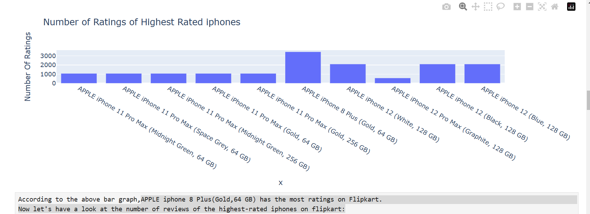
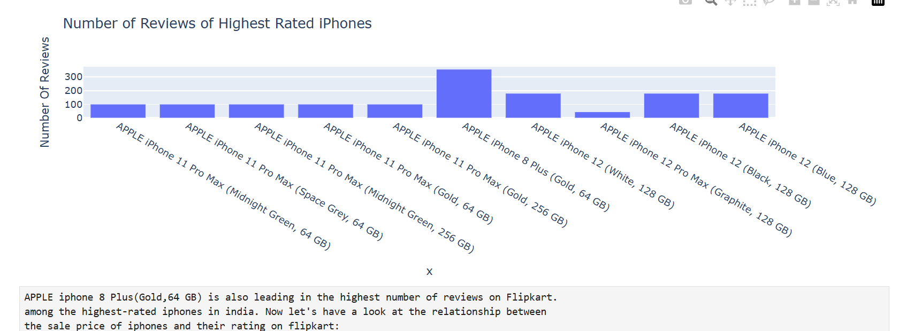
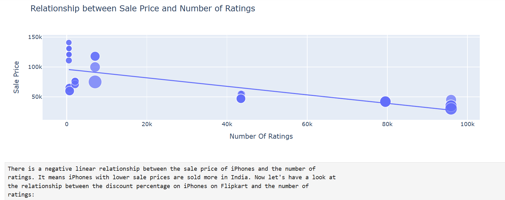
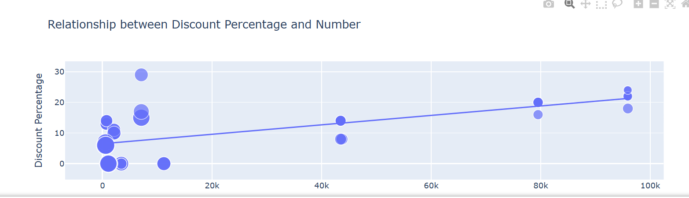

# Import Libraries

import pandas as pd
import numpy as np
import plotly.express as px
import plotly.graph_objects as go

# Getting Head values from CSV file
data = pd.read_csv("apple_products.csv")
print(data.head())

# Number of ratings of the highest-rated iPhones on flipkart

iphones = highest_rated["Product Name"].value_counts()
label = iphones.index
counts = highest_rated["Number Of Ratings"]
figure = px.bar(highest_rated, x=label, 
                y = counts, 
            title="Number of Ratings of Highest Rated iphones")
figure.show()

# Getting number of review of the highest rated iphones on flipkart

iphones = highest_rated["Product Name"].value_counts()
label = iphones.index
counts = highest_rated["Number Of Reviews"]
figure = px.bar(highest_rated, x=label,
                y = counts,
            title="Number of Reviews of Highest Rated iPhones")
figure.show()

# Relationship between sale price and number of ratings

figure = px.scatter(data_frame = data, x="Number Of Ratings",
                    y="Sale Price", size="Discount Percentage",
                    trendline="ols",
                    title="Relationship between Sale Price and Number of Ratings")
figure.show()

# Relationship between discount, percentage and number

figure = px.scatter(data_frame = data, 
                    x="Number Of Ratings",
                    y="Discount Percentage", size="Sale Price",
                    trendline="ols",
                    title="Relationship between Discount Percentage and Number")
figure.show()

